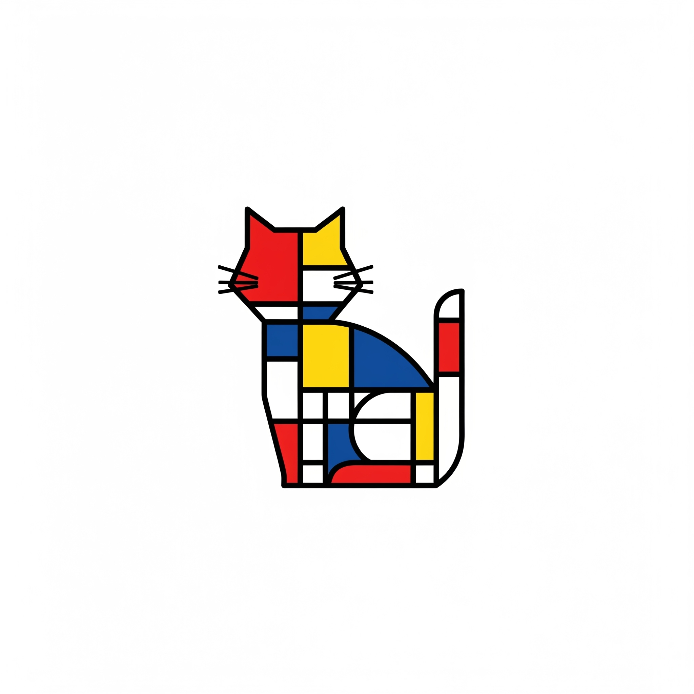

# CALICO - Cone Attribute Linking by Image and Cluster Output

<div align="left">
  
  <h2>C++ 센서 융합 패키지</h2>
</div>

고성능 C++ 센서 융합 패키지로, 자율주행 레이싱을 위한 YOLO 객체 검출과 LiDAR 포인트 클라우드 데이터를 결합합니다.

## 개요

CALICO는 기존 Python 기반 `hungarian_association` 패키지를 C++로 재구현한 것으로, 다음과 같은 특징을 가집니다:

- **5배 이상의 성능 향상** (목표)
- **기존 설정 파일과 100% 호환**
- **멀티 카메라 지원**
- **비침습적 개발** - 기존 시스템에 영향 없이 점진적 전환 가능

## 현재 개발 상태

### ✅ 완료된 기능
- 기본 패키지 구조 및 빌드 시스템
- 설정 파일 로더 (Python 호환)
- 메시지 변환 유틸리티
- 멀티카메라 융합 노드 기본 구조

### 🚧 개발 중인 기능
- Hungarian 알고리즘 통합
- 실제 센서 융합 로직
- UKF (Unscented Kalman Filter) 추적 시스템
- RViz 시각화

## 빠른 시작

### 1. 빌드

```bash
cd /home/user1/ROS2_Workspace/ros2_ws
colcon build --packages-select calico
```

### 2. 실행

```bash
# 환경 설정
source /opt/ros/humble/setup.bash
source install/setup.bash

# 노드 직접 실행
ros2 run calico multi_camera_fusion_node --ros-args \
  -p config_file:=/home/user1/ROS2_Workspace/ros2_ws/src/hungarian_association/config/multi_hungarian_config.yaml

# Launch 파일 사용
ros2 launch calico multi_camera_fusion.launch.py
```

## 설정

CALICO는 기존 `hungarian_association` 패키지의 설정 파일을 그대로 사용합니다:

- `multi_hungarian_config.yaml` - 메인 설정
- `multi_camera_intrinsic_calibration.yaml` - 카메라 내부 파라미터
- `multi_camera_extrinsic_calibration.yaml` - 카메라 외부 파라미터

## 토픽 인터페이스

### 입력
- `/sorted_cones_time` - LiDAR 콘 위치
- `/camera_1/detections`, `/camera_2/detections` - YOLO 검출 결과

### 출력
- `/fused_sorted_cones` - 융합된 콘 데이터

## 기존 시스템과의 전환

CALICO는 기존 Python 패키지와 동일한 인터페이스를 제공하므로, 다음과 같이 간단히 전환할 수 있습니다:

```bash
# Python 버전 (기존)
ros2 run hungarian_association yolo_lidar_multicam_fusion_node

# C++ 버전 (CALICO)
ros2 run calico multi_camera_fusion_node --ros-args -p config_file:=...
```

문제가 발생하면 언제든지 Python 버전으로 돌아갈 수 있습니다.

## 개발 로드맵

- [ ] Phase 1: Hungarian 알고리즘 통합
- [ ] Phase 2: 멀티카메라 융합 구현
- [ ] Phase 3: UKF 추적 시스템
- [ ] Phase 4: 성능 최적화
- [ ] Phase 5: 테스트 및 검증

## 라이센스

Apache-2.0